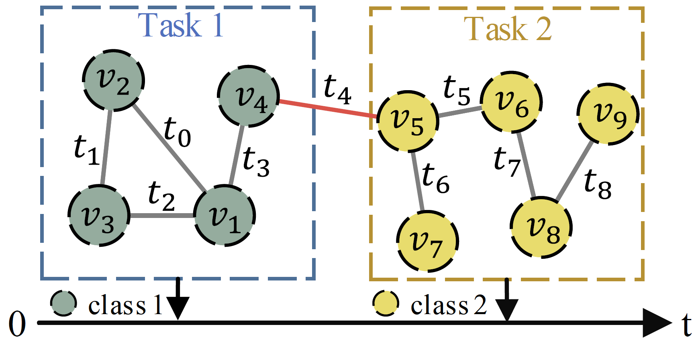

# OTGNet: Towards Open Temporal Graph Neural Networks (ICLR 2023)


|                 Open Temporal Graph                  |                        OTGNet                        |
| :--------------------------------------------------: | :--------------------------------------------------: |
|  |  |


## Introduction

This repository contains the code for paper: [Towards Open Temporal Graph Neural Netwroks](https://openreview.net/pdf?id=N9Pk5iSCzAn). This paper is accepted as ICLR 2023 notable-top-5% paper. 

**TL;DR**: We propose a general and principled learning approach for open temporal graphs where the class set for nodes is open.

## Setup

Clone the repo and build the environment

```bash
git clone https://github.com/tulerfeng/OTGNet.git
conda env create -f environment.yml
conda activate OTGNet
```

## Dataset

Download raw data of three datasets and use the code in `./process_raw_data` folder to process the raw data with [GloVe](https://nlp.stanford.edu/data/glove.42B.300d.zip)

+ [Reddit](https://files.pushshift.io/reddit/comments/)
+ [Yelp](https://www.yelp.com/dataset)
+ [Taobao](https://tianchi.aliyun.com/dataset/dataDetail?dataId=9716)

We also provide the processed datasets for direct use which could be downloaded at [here](https://drive.google.com/file/d/1s0sfgAMrNi-NOQCCFqIGFNK9K_zdKh9a/view?usp=share_link). 

Put the processed datasets in `./data` folder

## Training

Train model on the Reddit dataset

```bash
python run.py reddit
```

Train model on the Yelp dataset

```bash
python run.py yelp
```

Train model on the Taobao dataset

```bash
python run.py taobao
```

## Acknowledgement

This implementation is based on code from several repositories.

+ [TGN](https://github.com/twitter-research/tgn)
+ [Influence Function](https://github.com/mr3coi/influence_fn_pytorch)
+ [CLUB](https://github.com/Linear95/CLUB)

## Citation

If you find our repo, dataset or paper useful, please cite us as

> ```
> @inproceedings{fengtowards,
>   title={Towards Open Temporal Graph Neural Networks},
>   author={Feng, Kaituo and Li, Changsheng and Zhang, Xiaolu and ZHOU, JUN},
>   booktitle={International Conference on Learning Representations}
> }
> ```

## License

All code within this repository is under [Apache License 2.0](https://www.apache.org/licenses/LICENSE-2.0).